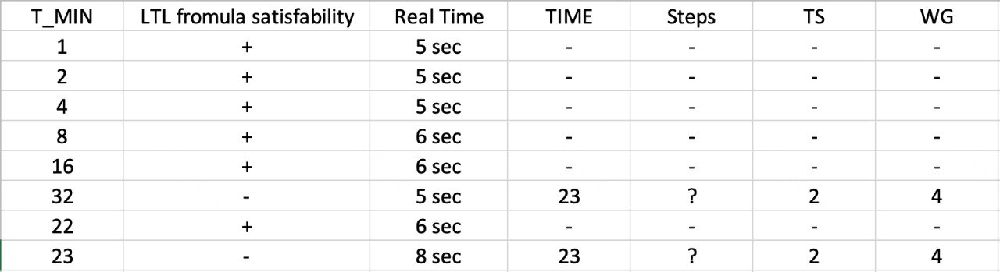

# GPU-program params' autotune model — Level 1

TLA+/PlusCal model for verifying temporal correctness of GPU kernel execution. Level 1: no warps, no warp scheduler — each PE is an independent process.

## Architecture

```
Main          — init memory & tuning params (nondeterministic)
├── Host      — kernel launch/stop
│   └── Device[d]
│       └── Unit[d][u]
│           └── PEX[d][u][p]   — compute
└── Clock     — global tick
```

Processes communicate via async FIFO channels (`hst_d`, `d_hst`, `dev_u`, `u_dev`, `u_pex`, `pex_u`). IDs are 4-tuples: `<<tag, d, u, p>>` where tag encodes the level (0=Clock, 1=Main, ..., 5=PEX).

### Message protocol

| Message | Direction | Meaning |
|---------|-----------|---------|
| `GO` | Host→Device→Unit | Start / next work-group |
| `GOWG` | Unit→PEX | Assign work-group to PE |
| `STOP` | Host→…→PEX | Terminate, start reduction |
| `DONE` | PEX→…→Host | Work-group finished |
| `EOI/NEOI` | PEX→Unit | All iterations done / need more |

## Clock

Single `fair process`. Advances `globalTime` by 1 when **all** active (non-barrier-blocked) PEs have registered a step:

```
tick condition:
    nRunningPEs = allWorkingPEs - nWaitingPEs
    ∧ allWorkingPEs ≠ 0
    ∧ nWaitingPEs ≠ allWorkingPEs
```

Each PE doing a long operation (memory access) loops:
1. `nRunningPEs++` — register
2. `await globalTime ≥ curTime + 1` — wait for tick
3. Check if enough ticks elapsed (`≥ GLOBAL_MEMORY_ACCESS`)

This enforces **lockstep time** across all PEs.

## Barrier

Two-phase fetch-and-add barrier (`nWaitingPEs` / `nWaitingPEsOut`). Two phases prevent the race where a fast PE re-enters the barrier before the last PE exits the current one.

PEs blocked on the barrier are excluded from the clock condition via `allWorkingPEs - nWaitingPEs`, so they don't stall time progression.

## No warps / no scheduler — implications

In a real GPU, a warp scheduler selects which warp executes each cycle, enabling latency hiding. This model has none of that:

- **All PEs run fully in parallel** — optimistic lower bound on time
- **No SIMD divergence penalty** — branches are free
- **Smaller state space** — feasible to model-check larger configs
- **Clock condition is simpler** — counts individual PEs, not warps

This is sufficient for verifying the communication protocol, barrier correctness, and coarse timing bounds. For warp-level effects, use the Level 2 model.

## Constants

| Constant | Description | Constraint |
|----------|-------------|------------|
| `N` | Power-of-2 param | `INPUT_DATA_SIZE = 2^N` |
| `INPUT_DATA_SIZE` | Input array size | Must be `2^N` |
| `GLOBAL_MEMORY_ACCESS` | Memory latency (ticks) | ≥ 1 |
| `LOCAL_MEMORY_SIZE` | Local mem per unit | ≥ `PES_PER_UNIT` |
| `UNITS_PER_DEVICE` | CUs per device | ≥ 1 |
| `DEVICES` | Number of devices | ≥ 1 |
| `PES_PER_UNIT` | PEs per unit | ≥ 1 |

`Main` nondeterministically picks `workGroupSize` and `tileSize` from powers of 2. TLC explores all valid combinations.

## Properties

| Property | Type | Meaning |
|----------|------|---------|
| `Termination` | Liveness | All processes eventually reach `Done` |
| `OverTime` | Safety | `final ⇒ globalTime > Tmin` |
| `DebugInv` | Debug | `final ⇒ FALSE` — forces counterexample trace |

## Running with TLC Toolbox

1. **Open spec** → `autotune.tla`
2. **New Model**, set constants:

```
N              = 3
INPUT_DATA_SIZE = 8
GLOBAL_MEMORY_ACCESS = 2
LOCAL_MEMORY_SIZE    = 4
UNITS_PER_DEVICE     = 1
DEVICES              = 1
PES_PER_UNIT         = 2
```

3. **Behavior spec** → `Spec`
4. **Check deadlock** → ✓
5. **Properties** → `Termination`, `OverTime`
6. **Invariants** → `DebugInv` (optional, for tracing)
7. **Run**

Expect ~10⁵ states for the minimal config, minutes for D=1/U=2/P=4/N=4.

## Results for TLC Toolbox verification



## Running with Apalache

Apalache does **bounded** model checking via SMT. Useful for fast bug-finding; does **not** support liveness (`Termination`).

### Safety check

```bash
apalache-mc check \
    --config=autotune.cfg \
    --inv=OverTimeSafety \
    --length=50 \
    autotune.tla
```

`autotune.cfg`:
```
CONSTANTS
    N = 3
    INPUT_DATA_SIZE = 8
    GLOBAL_MEMORY_ACCESS = 2
    LOCAL_MEMORY_SIZE = 4
    UNITS_PER_DEVICE = 1
    DEVICES = 1
    PES_PER_UNIT = 2
INIT Init
NEXT Next
INVARIANT OverTimeSafety
```

Where `OverTimeSafety == final => (globalTime > Tmin)`.

### Known Apalache caveats

- May need `@type` annotations on constants/variables
- `CASE` in `Init` can cause issues — generated TLA+ uses it for `pc`
- `Sequences` support is limited; works for this model in recent versions (≥ 0.40)
- For full liveness verification, use TLC
