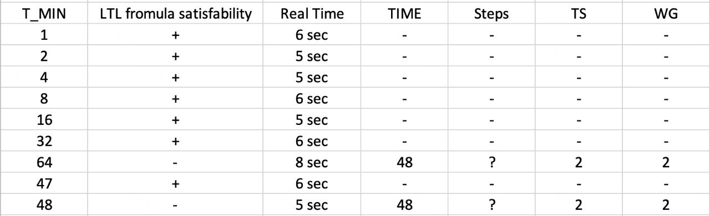

# GPU-program params' autotune model — Level 2

Formal TLA+/PlusCal model of GPU kernel execution **with warps and warp scheduler**. Extends Level 1 by grouping PEs into warps and introducing a per-unit round-robin warp scheduler that can hide memory latency. Verifies timing correctness, deadlock freedom, and barrier safety.

## Architecture

```
Main ──► Host ──► Device[d] ──► WarpScheduler[d][u] ──► Unit[d][u]
                                       │                      │
Clock (global tick) ◄── nRunningUnits sync ───────────────────┘
```

**6 process types**, identified by tuples:

| Process | ID | Role |
|---------|----|------|
| Clock | `<<0,0,0>>` | Advances `globalTime` |
| Main | `<<1,0,0>>` | Inits memory, picks params nondeterministically |
| Host | `<<5,0,0>>` | Launches kernel, collects results, sends STOP |
| Device | `<<4,d,0>>` | Distributes work-groups to schedulers, handles overflow |
| WarpScheduler | `<<2,d,u>>` | Round-robin warp dispatch, barrier-aware skip |
| Unit | `<<3,d,u>>` | Executes one warp instruction at a time (7 instr ISA) |

## Key Difference from Level 1

| Aspect | Level 1 (no warps) | Level 2 (with warps) |
|--------|--------------------|--------------------|
| Execution unit | Individual PE | Warp (group of PEs) |
| Scheduling | None — all PEs independent | Round-robin per unit |
| Latency hiding | No | Yes — scheduler switches warps during memory stalls |
| Clock sync granularity | Per-PE (`nRunningPEs`) | Per-Unit (`nRunningUnits`) |
| Barrier | PE-level fetch-and-add | Warp-level: `barrierIn[d][u*nWarpsPerUnit+w]` |
| Barrier-aware scheduling | N/A | Scheduler checks `isWarpReadyToRun` before dispatch |
| Timing accuracy | Optimistic (no warp overhead) | More realistic (serialized warp execution within unit) |

## Communication Channels

```
Host ◄──► Device:     hst_d, d_hst          (async FIFO, 1-D)
Device ──► Scheduler:  dev_sch[d][u]          (async FIFO, 2-D)
Scheduler ──► Device:  sch_dev[d][u]          (async FIFO, 2-D)
Scheduler ──► Unit:    sch_u[d][u]            (async FIFO, 2-D)
Unit ──► Scheduler:    u_sch[d][u]            (async FIFO, 2-D)
```

## Warp Scheduler

Each `WarpScheduler[d][u]` maintains a local queue of `<<warpId, instrId>>` pairs:

1. Receives `GO(wgId)` from Device → forwards to Unit, fills warp queue
2. **Schedule loop**: dequeue warp, check `isWarpReadyToRun` (= `1 - barrierIn`)
   - **Ready**: send `GOWARP(warpId, instrId)` to Unit, wait for `DONEWARP`
   - **Blocked on barrier**: re-enqueue, try next warp
3. After `DONEWARP`: increment `instrId`, re-enqueue if `< nInstructions`
4. Empty queue → send `STOPWARPS` to Unit, report `DONE` to Device

This enables **latency hiding**: while one warp waits on global memory, the scheduler dispatches another warp to the same unit.

## Unit (Compute)

Each `Unit[d][u]` is a **single-threaded executor** that processes one warp at a time. It implements 7 instructions:

| instrId | Operation | Memory | Notes |
|---------|-----------|--------|-------|
| 0 | Compute `localId` | — | Maps PE index within warp |
| 1 | Compute `globalOffset` | — | `tileSize * (wgId * workGroupSize + localId)` |
| 2 | Bounds check | — | Sets `readyToMin` predicate register |
| 3 | Min + global load | Global | `longWorkFlag` → wait `GLOBAL_MEMORY_ACCESS` ticks |
| 4 | Tile loop control | — | `tileIdx++`, loop back to instr 1 if not done |
| 5 | Barrier | — | Warp-level barrier via `barrierIn[]` |
| 6 | Final reduction | Local + Global | Reduce local mem, write global min |

Instructions 3 and 6 involve the **long_work** pattern:

```
register with nRunningUnits++  →  await globalTime >= curTime + 1  →  check if done
```

## Clock

Ticks when:
```
nRunningUnits = allWorkingUnits - nWaitingUnits
allWorkingUnits ≠ 0
nWaitingUnits ≠ allWorkingUnits
```

**Key**: sync counts **units** (not PEs). Each unit registers once per tick while waiting on memory. Warps blocked on barrier are excluded via `nWaitingUnits`.

## Barrier

Warp-level barrier using shared `barrierIn[d][u*nWarpsPerUnit + w]`:

1. Warp sets `barrierIn[...] = 1`
2. Unit scans all barrier slots across all devices/units
3. If count = `nWarps` → all warps arrived → reset all slots, clear `nWaitingUnits`
4. If count < `nWarps` → return `DONEWARP` with same `instrId` (scheduler will re-enqueue)
5. Scheduler checks `isWarpReadyToRun = 1 - barrierIn[...]` before dispatching — blocked warps are skipped

## Constants

| Constant | Meaning | Constraints |
|----------|---------|-------------|
| `N` | Power-of-2 param | ≥ 3 |
| `INPUT_DATA_SIZE` | Input array size | must be 2^N |
| `GLOBAL_MEMORY_ACCESS` | Global mem latency (ticks) | ≥ 1 |
| `LOCAL_MEMORY_ACCESS` | Local mem latency (ticks) | ≥ 1 |
| `LOCAL_MEMORY_SIZE` | Local mem per unit | ≥ PES_PER_UNIT |
| `UNITS_PER_DEVICE` | CUs per device | ≥ 1 |
| `DEVICES` | Number of devices | ≥ 1 |
| `PES_PER_UNIT` | PEs per unit (= warp width) | ≥ 1 |

`workGroupSize` and `tileSize` chosen **nondeterministically** by Main — TLC explores all valid decompositions.

**Derived** (computed by Main):
- `nWarpsPerUnit = workGroupSize ÷ nWorkingPEsPerUnit`
- `nWarps = nWarpsPerUnit × nWorkingUnitsPerDevice × nWorkingDevices`

## Properties

| Property | Type | Meaning |
|----------|------|---------|
| `Termination` | Liveness | All processes eventually reach `Done` |
| `OverTime` | Safety | `□(final ⇒ globalTime > Tmin)` |

## Running with TLC Toolbox

1. Open spec, create model
2. Set constants (start small):

```
N = 3, INPUT_DATA_SIZE = 8, GLOBAL_MEMORY_ACCESS = 2,
LOCAL_MEMORY_ACCESS = 1, LOCAL_MEMORY_SIZE = 4,
UNITS_PER_DEVICE = 1, DEVICES = 1, PES_PER_UNIT = 2
```

3. Behavior spec: `Spec`
4. Check **Deadlock**
5. Add properties: `Termination`, `OverTime`
6. Run

## State Space Notes

Level 2 has **larger state space** than Level 1 for equivalent configs due to:
- Scheduler process per unit (additional interleaving)
- Warp queue ordering (sequence permutations)
- `isWarpReadyToRun` / `barrierIn` arrays

| Config (D×U×P, N) | Warps/unit | Estimated complexity | Notes |
|--------------------|-----------|---------------------|-------|
| 1×1×2, N=3 | 1–2 | ~10⁶ | seconds–minutes |
| 1×1×2, N=4 | 1–4 | ~10⁸ | minutes |
| 1×2×2, N=4 | 1–4 | ~10¹⁰+ | hours+ |

Scale cautiously. The scheduler interleaving is the main blowup factor.

## Results for TLC Toolbox verification



## Running with Apalache

Apalache does **bounded** model checking via SMT. Useful for fast bug-finding; does **not** support liveness (`Termination`).

### Safety check

```bash
apalache-mc check \
    --config=autotune.cfg \
    --inv=OverTimeSafety \
    --length=50 \
    autotune.tla
```

`autotune.cfg`:
```
CONSTANTS
    N = 3
    INPUT_DATA_SIZE = 8
    GLOBAL_MEMORY_ACCESS = 2
    LOCAL_MEMORY_SIZE = 4
    UNITS_PER_DEVICE = 1
    DEVICES = 1
    PES_PER_UNIT = 2
INIT Init
NEXT Next
INVARIANT OverTimeSafety
```

Where `OverTimeSafety == final => (globalTime > Tmin)`.

### Known Apalache caveats

- May need `@type` annotations on constants/variables
- `CASE` in `Init` can cause issues — generated TLA+ uses it for `pc`
- `Sequences` support is limited; works for this model in recent versions (≥ 0.40)
- For full liveness verification, use TLC
